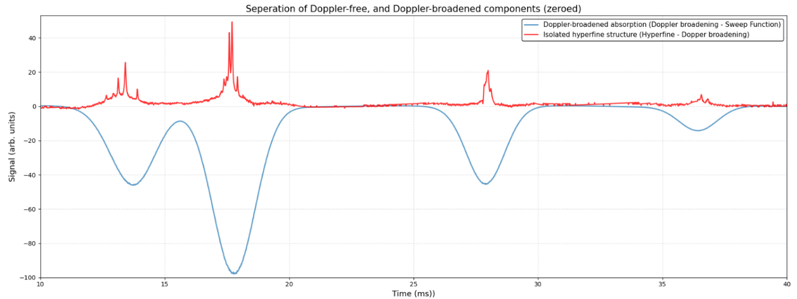
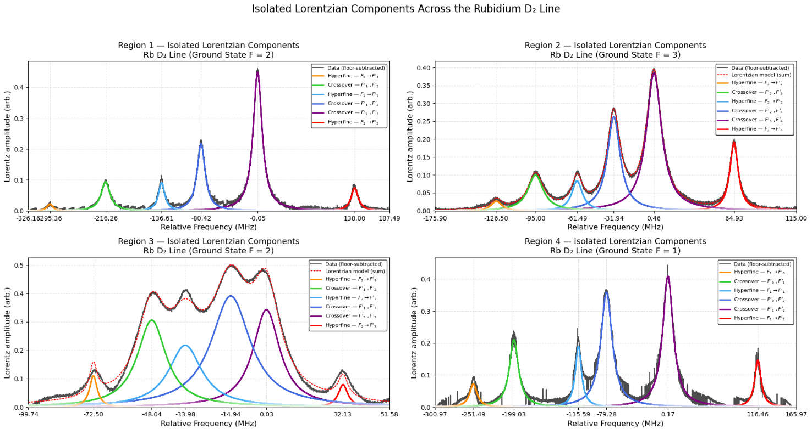

# Atomic Physics Laboratory

Doppler-free spectroscopy of rubidium, resolving the hyperfine structure of the D₂ transition near 780 nm through frequency calibration and spectral fitting.

**77% | First Class**

[Read the laboratory report](report/atomic-physics-laboratory.pdf)

## Separating the spectrum

Counter-propagating pump and probe beams reveal narrow resonances within the much broader thermal absorption profile. Subtracting the reference traces separates the two contributions.

*Figure 3 from the report: the Doppler-broadened component in blue and the Doppler-free component in red.*

I aligned the oscilloscope recordings, accounted for acquisition offsets and voltage scales, and used Fabry–Pérot cavity resonances to convert the time axis into relative frequency. Gaussian fits to the broad absorption troughs gave ground-state splittings of **3.017 GHz for ⁸⁵Rb** and **6.832 GHz for ⁸⁷Rb**.

## Resolving the hyperfine peaks

*Figure 8 from the report: individual Lorentzian components across the four hyperfine regions, with hyperfine and crossover resonances labelled.*

Each region was fitted with a sum of Lorentzians and a polynomial background. Removing the fitted background isolates the narrow resonances, allowing their centres and widths to be compared. Crossover resonances occur between transitions and need to be distinguished from the hyperfine lines when extracting energy splittings.

| Reported quantity | ⁸⁵Rb | ⁸⁷Rb |
| --- | ---: | ---: |
| Ground-state magnetic-dipole constant A | 1006 ± 15 MHz | 3416 ± 5 MHz |
| Excited-state magnetic-dipole constant A | 26 ± 1 MHz | 87 ± 3 MHz |
| Excited-state electric-quadrupole constant B | 28 ± 3 MHz | 15 ± 3 MHz |
| Hyperfine resonance linewidth | 9.7 ± 0.2 MHz | 11.25 ± 0.01 MHz |

The report examines frequency-sweep nonlinearity of approximately **1.5 ± 0.3%**, alongside calibration, alignment and power broadening. The quoted values and uncertainties come from the original laboratory analysis.

## Analysis code

- CSV import with explicit channel names, timing and voltage corrections.
- Interpolation over the common measurement interval and separation of the Doppler components.
- Piecewise-linear frequency calibration between consecutive cavity resonances.
- Gaussian and Lorentzian fitting with bounded peak centres and an optional polynomial background.
- Background subtraction and conversion of ground-state splitting to the magnetic-dipole constant.

The calibration uses **0.0897 m cavity length** by default, peak guesses and bounds are supplied for each measured region; the fit retains lmfit's component parameters, covariance and fit report.

**Tools:** Python, NumPy, pandas, lmfit and Matplotlib.
